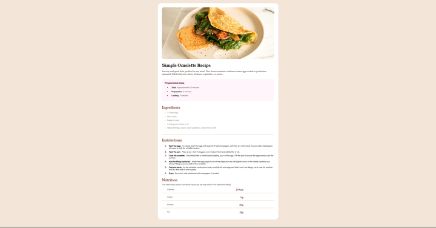

# Frontend Mentor - Recipe page solution

This is a solution to the [Recipe page challenge on Frontend Mentor](https://www.frontendmentor.io/challenges/recipe-page-KiTsR8QQKm). Frontend Mentor challenges help you improve your coding skills by building realistic projects. 

## Table of contents

- [Overview](#overview)
  - [The challenge](#the-challenge)
  - [Screenshot](#screenshot)
  - [Links](#links)
- [My process](#my-process)
  - [What I learned](#what-i-learned)
- [Author](#author)

## Overview

- The challenge this time is also pretty straightforward. Similar to previous challenges, creating a centered card element that contains information about something/someone. However, for this one, there's a whole lot more formatting in terms of text and list orientation.

### Screenshot

### Links

- Live Site URL: [Github Pages](https://your-live-site-url.com)

## My process

- Since this challenge is pretty similar to the previous challenges, I also had a simiilar process with each and every one of them. Started of with the main container div and structured the rest of the contents according to the specifications as much as I possibly could.

### Built with

- Semantic HTML5 markup
- CSS custom properties
- Flexbox

### What I learned

- For this challenge, I kinda got confused with the overall width of the parent container for the main content. In the reference, it seemed that it was smaller than the overall size of the body and so it would have to be scaled down since what I did was somewhat incorrect. I initally had the width and height set to auto but I eventually got to fixing it by the end of the project. I know it doesn't really match the sizing of the original and that is something I still should work on but other than that, I'd say this project went smoothly.

## Author

- Frontend Mentor - [@kr0ma-git](https://www.frontendmentor.io/profile/kr0ma-git)
- Github - [@kr0ma-git](https://github.com/kr0ma-git)